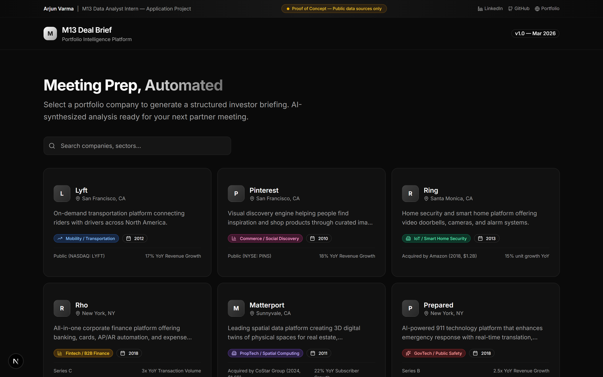
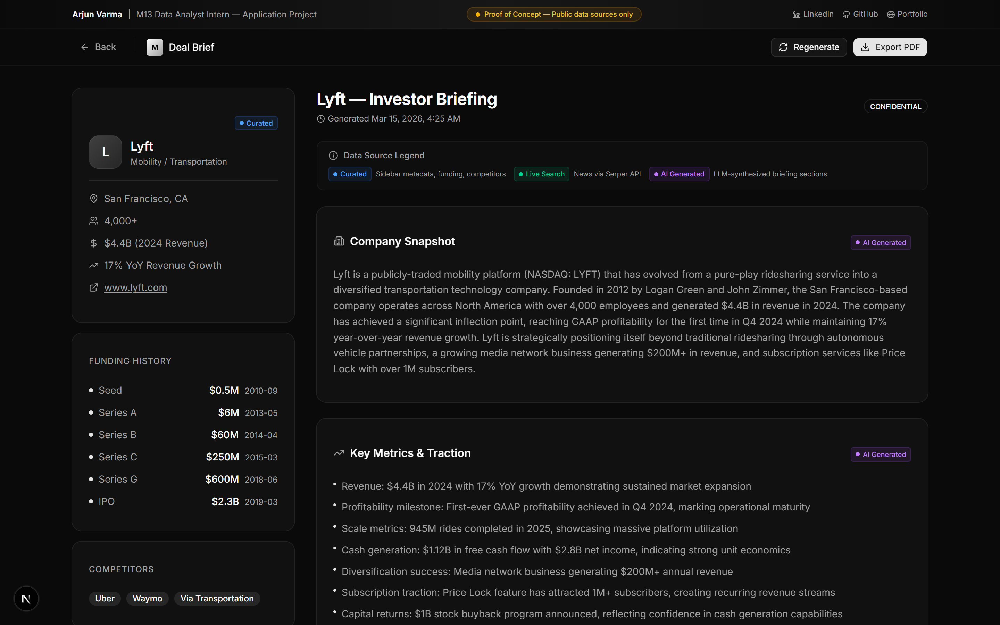

# M13 Deal Brief — Portfolio Intelligence Platform

### **[Live Demo](https://m13-deal-brief-686529012610.us-central1.run.app)**

> **Project Showcase by Arjun Varma** for the **M13 Data Analyst Intern** position (Summer 2026)
>
> [LinkedIn](https://linkedin.com/in/varma-arjun/) · [GitHub](https://github.com/ARJUNVARMA2000) · [Portfolio](https://arjun-varma.com) · [av3342@columbia.edu](mailto:av3342@columbia.edu)

A professional web application that generates structured investor briefing documents for M13 portfolio companies. Given a company, it synthesizes curated data + live news via LLM into a meeting-ready briefing document.

   

### Company Selector


### AI-Generated Investor Briefing with Data Source Labels


---

## Important: Proof of Concept

This project is a **proof of concept** built to demonstrate my approach to the "Meeting Prep Automation" project listed in the M13 job description. Key caveats:

- **Public data sources only** — All company data is curated from publicly available information (press releases, Crunchbase, SEC filings). No proprietary or confidential data is used.
- **Not production-ready** — This is a 1-day sprint showcasing architecture, AI integration, and product thinking. A production version would incorporate M13's internal systems (Affinity/DealCloud, portfolio reports).
- **LLM-generated content** — Briefings are synthesized by AI and should not be treated as investment advice or factual reporting.

The goal is to show *how* I'd build this tool, not to deliver a finished product. With access to M13's CRM (Affinity/DealCloud), portfolio reporting, and internal deal memos, this architecture scales directly into a real internal tool.

---

## What It Does

1. **Browse** — View 6 M13 portfolio companies with key metadata (sector, stage, metrics)
2. **Generate** — Click any company to generate a 7-section AI-powered investor briefing
3. **Export** — Download the briefing as a PDF for offline use in partner meetings

### Briefing Sections
- Company Snapshot
- Key Metrics & Traction
- Recent Developments (synthesized from live news + curated milestones)
- Competitive Landscape
- M13 Relationship Context
- Suggested Discussion Topics
- Risk Factors

---

## How It Works

```
┌─────────────────────────────────────────────────────────────────┐
│                        DATA FLOW                                │
│                                                                 │
│  ┌──────────────┐    ┌──────────────┐    ┌──────────────────┐   │
│  │   Curated     │    │  Serper API  │    │   OpenRouter     │   │
│  │   Data (JSON) │    │  (Live News) │    │   LLM (Claude)   │   │
│  │              │    │              │    │                  │   │
│  │  • Company   │    │  • Google    │    │  • Synthesizes   │   │
│  │    metadata  │    │    News API  │    │    all inputs    │   │
│  │  • Funding   │    │  • Real-time │    │  • Structured    │   │
│  │  • Metrics   │    │    articles  │    │    7-section     │   │
│  │  • Comps     │    │              │    │    briefing      │   │
│  └──────┬───────┘    └──────┬───────┘    └────────┬─────────┘   │
│         │                   │                     │             │
│         └───────────────────┼─────────────────────┘             │
│                             │                                   │
│                    ┌────────▼────────┐                          │
│                    │  /api/brief     │                          │
│                    │  (Next.js API)  │                          │
│                    └────────┬────────┘                          │
│                             │                                   │
│                    ┌────────▼────────┐                          │
│                    │  Briefing UI    │                          │
│                    │  + PDF Export   │                          │
│                    └─────────────────┘                          │
└─────────────────────────────────────────────────────────────────┘
```

---

## Data Sources

Every piece of data in a briefing comes from one of three sources, each labeled in the UI:

| Source | Label | What It Includes |
|--------|-------|------------------|
| **Curated Data** | 🔵 Curated | Company metadata, funding history, competitors, key metrics — hand-curated from public sources (Crunchbase, SEC filings, press releases) and stored in `src/data/companies.ts` |
| **Live Search** | 🟢 Live Search | News articles fetched in real-time via [Serper API](https://serper.dev/) (Google News) at briefing generation time |
| **AI Generated** | 🟣 AI Generated | All 7 briefing sections — synthesized by LLM (via OpenRouter) from curated data + live news into structured investor intelligence |

> **Transparency note:** The briefing UI displays colored badges on each section so readers always know the provenance of the information they're reading. Sidebar company data is curated; news is live-searched; briefing prose is AI-generated.

---

## Tech Stack

| Layer | Technology | Why |
|-------|-----------|-----|
| Frontend | Next.js 15 + React 19 | App Router for API routes + SSR, industry standard |
| Styling | Tailwind CSS 4 + shadcn/ui | Professional dark theme, rapid iteration |
| LLM | OpenRouter API (Claude/GPT) | Model-agnostic, cost-effective for prototyping |
| News | Serper API (optional) | Free tier for live Google News results |
| Data Pipeline | Python + pandas | Demonstrates data engineering skills (see notebook) |
| Export | html2pdf.js | Client-side PDF generation, zero server cost |

---

## Quick Start

```bash
# Clone and install
git clone https://github.com/ARJUNVARMA2000/m13-deal-brief.git
# Or: gh repo clone ARJUNVARMA2000/m13-deal-brief
cd m13-deal-brief
npm install

# Add your API keys
cp .env.example .env.local
# Edit .env.local with your OpenRouter key

# Run locally
npm run dev
```

Open [http://localhost:3000](http://localhost:3000) — or visit the live deployment at **[m13-deal-brief-686529012610.us-central1.run.app](https://m13-deal-brief-686529012610.us-central1.run.app)**.

> **No API key?** The app works without one — it generates briefings from curated data using a fallback template. Add an OpenRouter key for AI-synthesized briefings.

---

## Design Decisions

### Why Next.js instead of a Python backend?
The primary deliverable is a polished web UI that non-technical users (partners) interact with. Next.js API routes eliminate the need for a separate backend, and the App Router provides a modern, fast experience. Python skills are demonstrated in the supplementary notebook.

### Why curated data + LLM instead of pure API scraping?
Real VC data is messy and siloed. This hybrid approach mirrors reality — structured internal data supplemented by live signals, synthesized by AI into actionable intelligence. It's the same architecture you'd use with Affinity/DealCloud data internally.

### Why a fallback briefing system?
Graceful degradation. If the LLM API is down or slow, the app still produces useful output. In production, you'd want this reliability for time-sensitive meeting prep.

---

## Python Notebook

`data_pipeline.ipynb` demonstrates the data engineering side:
- Portfolio data collection and normalization
- Sector distribution and funding analysis with pandas/matplotlib
- Web scraping approach for news aggregation
- Capital efficiency and exit performance metrics
- JSON export pipeline for the web app

```bash
pip install pandas matplotlib jupyter
jupyter notebook data_pipeline.ipynb
```

---

## Project Structure

```
m13-deal-brief/
├── src/
│   ├── app/
│   │   ├── api/
│   │   │   ├── companies/route.ts   # GET /api/companies
│   │   │   ├── brief/route.ts       # GET /api/brief?company=slug
│   │   │   └── export/route.ts      # Placeholder for server-side export
│   │   ├── brief/[slug]/page.tsx     # Briefing view page
│   │   ├── layout.tsx                # Root layout (dark theme)
│   │   ├── page.tsx                  # Company selector (home)
│   │   └── globals.css               # Tailwind + shadcn theme
│   ├── components/
│   │   ├── top-ribbon.tsx            # Applicant info + POC disclaimer
│   │   └── ui/                       # shadcn/ui components
│   ├── data/companies.ts             # Curated portfolio data
│   └── lib/
│       ├── openrouter.ts             # LLM client + prompt engineering
│       └── utils.ts                  # Utility functions
├── data_pipeline.ipynb               # Python data pipeline demo
├── .env.example                      # Environment variables template
└── README.md
```

---

## About Me

**Arjun Varma** — MS Data Science, Columbia University (Dec 2026)

3+ years at ZS Associates building data/ML pipelines for $10B+ pharma portfolios. Experience spans PySpark ETL, ML model development, LLM/RAG systems, and full-stack data applications. Currently a TA at Columbia Business School for AI and Analytics courses.

**Relevant experience for this role:**
- Built org-wide analytics platforms unifying 5+ data sources for 100+ stakeholders
- Developed ML models on 250M+ patient claims for early cancer detection (presented at PMSA 2025)
- Built RAG chatbots, multi-agent AI systems, and production data pipelines
- Python, SQL, Spark, ML/NLP, LLMs, prompt engineering

[LinkedIn](https://linkedin.com/in/varma-arjun/) · [GitHub](https://github.com/ARJUNVARMA2000) · [Portfolio](https://arjun-varma.com) · av3342@columbia.edu
